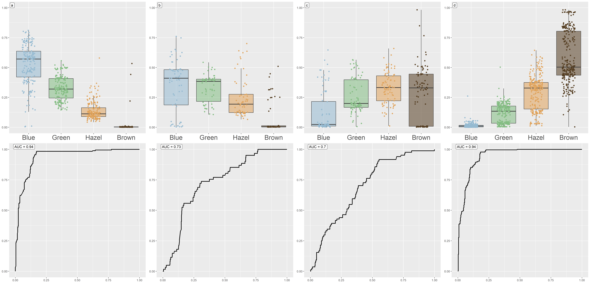
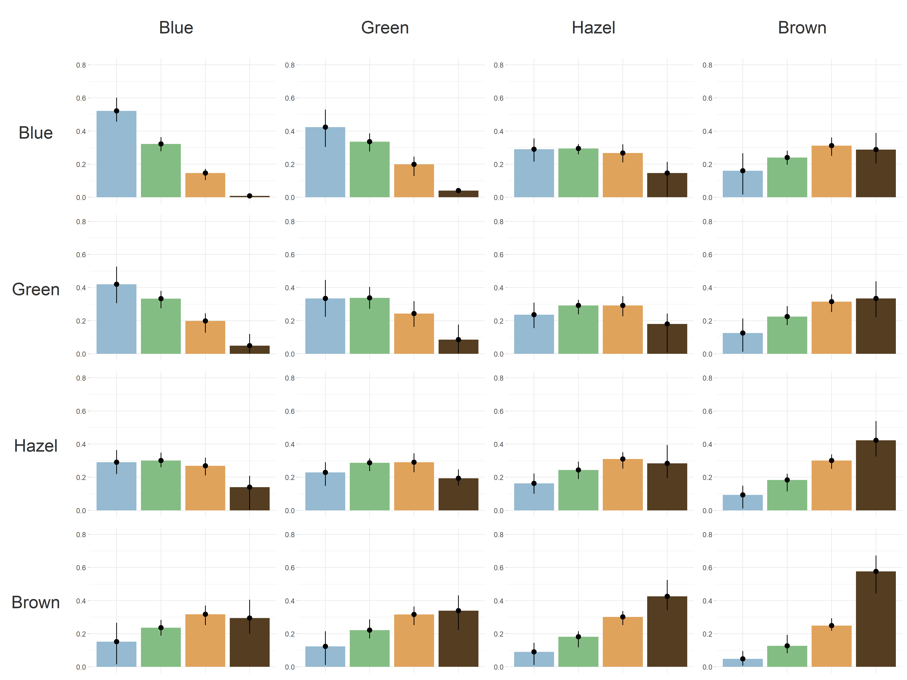

COITR — a novel algorithm for predicting externally visible traits of а child
=================================================

Authors: Kozlova K, Nizamutdinov I, Slepov N, Surkova E, Popov I, Tsukanov K, Ilinsky V, Rakitko A 


Installation
------------------------------------------------

R, R-packages (optparse, RJSONIO, stringr, e1071, SDMTools available from CRAN repo).


Ideas and Basics
-------------------
COITR (Calculator Of Infant's TRaits) is a novel algorithm for predicting phenotypic features of a child such as eye, hair and skin color and presence of freckles from genetic data of parents. For prediction of externally visible traits, we used data from OpenSNP and Bayesian approach (for details see publication [1]).


Prediction accuracy of our approach is comparable to other methods [2]. The following plots demonstrate the accuracy metrics for eye color prediction.


### Prediction accuracy: person's eye color from genotypes
a,b,c,d represent the probabilities of 4 colors of eyes for people with blue, green, hazel and brown eyes respectively. Second row corresponds to AUC-ROC.
  


### Prediction accuracy: child's eye color from parent genotypes
Bars indicate the average probability whereas whiskers indicate 25% and 75% quartiles (correspond to different genetic profiles of the parents within the same phenotypic groups)
  


Scripts description:
---------------------

**Phenotypes.R**     
*Predicts phenotypic features of a person*

Input:  
* `--txt`  23andme chip-like file
* `--all`  population.csv (genotypes of reference population)
* `--phen` Phenotypes.json (conditional probabilities, thresholds and other internal stuff)
* `--out`  output folder

Output:  
* `_appearance.json` JSON-file with person genotypes, phenotype probabilities, phenotype predictions and phenotype probabilities, quantiles and SD of this probabilties for a probable child


**COITR.r**     
*Predicts phenotypic features of a child of two persons*

Input:  
* `--ind1` output from Phenotypes.R for first person
* `--ind2` output from Phenotypes.R for second person
* `--phen` Phenotypes.json (conditional probabilities, thresholds and other internal stuff)
* `--out`  output folder

Output:  
* `child.json` JSON-file with child's phenotype probabilties, quantiles and SD of this probabilties


**Phenotypes.json**
This JSON-file was precomputed using open data. It contains conditional probabilities for Bayesian approach, calculated on OpenSNP data for eye and hair color and presence of freckles and 1000Genomes data for skin color.

Usage example:
-------------------------
See example files in Examples.zip

Calculate person1 phenotypic features and write output to current folder:    
```bash
Rscript Phenotypes.R --txt person1_chip.txt --all population.csv --phen Phenotypes.json --out ./
```

Calculate child phenotypic features based on output from Phenotypes.R for two persons:    
```bash
Rscript COITR.r --ind1 person1_appearance.json --ind2 person2_appearance.json --phen Phenotypes.json --out ./
```

References:
----------------------
[1] BioRxiv  
[2] Pośpiech E, Draus-Barini J, Kupiec T, Wojas-Pelc A, Branicki W. Prediction of eye color from genetic data using Bayesian approach. J Forensic Sci. 2012 Jul;57(4) 880-886. doi:10.1111/j.1556-4029.2012.02077.x. PMID: 22372960.

